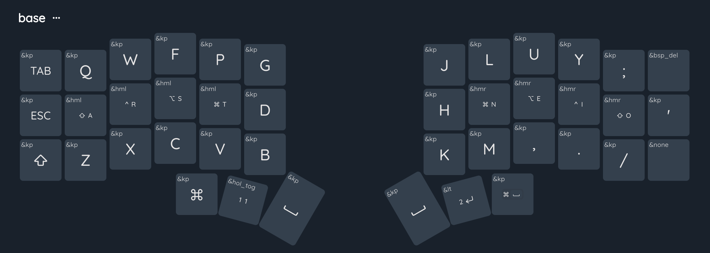

# ZMK Nano

This is a customization of the ZMK config for the SplitKB Aurora Corne Nano
split wireless keyboard with machine readable layout and keymap definitions 
for use with my [keymap-editor] tool.

> **Note**
> I'm using a Colemak layout with homerow mods, a numeric layer with
> keypad layout (toggled and momentary), and a symbols layer for all brackets
> etc.
> Some combos are defined (ij, sch, tion) for easier typing.
> A behavior for backspace/delete is defined for use with Ctrl (as in macOS)
> 

## How should I use this

- Read through the keymap and layout files here.
- Generate your own from this [template], and link your repo to the keymap editor app.
- Use [keymap-layout-tools] to preview changes to a layout definition to apply to other keyboards.

[keymap-editor]:https://github.com/nickcoutsos/keymap-editor
[keymap-layout-tools]:https://nickcoutsos.github.io/keymap-layout-tools/
[`config/corne.keymap`]:config/corne.keymap
[`config/corne.json`]:config/corne.json
[template]:https://github.com/nickcoutsos/keymap-editor-demo-crkbd/generate
